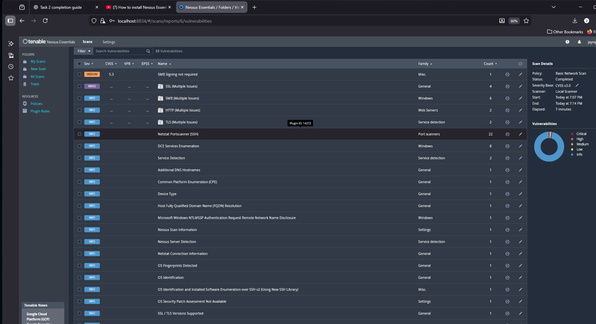
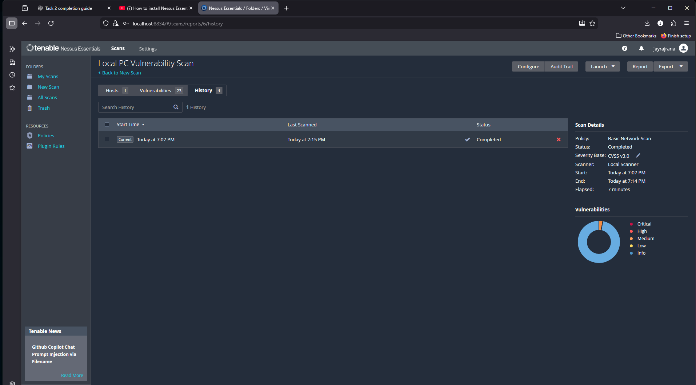

# Task 3 – Basic Vulnerability Scan

This repository contains the work completed for Task 3 of the Cyber Security Internship.  
The objective of this task was to perform a vulnerability scan on my personal computer using a free vulnerability scanning tool and document the results.

## Tool Used
I used **Nessus Essentials**, which is a free vulnerability scanner provided by Tenable.  
It allows basic vulnerability scanning on a single local system.

## What I Did
1. Installed and activated Nessus Essentials.
2. Created a new “Basic Network Scan”.
3. Entered my system’s local IP address as the target.
4. Launched the scan and waited for it to complete.
5. Reviewed the vulnerabilities identified by Nessus.
6. Documented the main findings in a separate report.
7. Added the screenshots of the scan results to this repository.

## Scan Summary
- Severity Base: CVSS v3.0  
- Scan Duration: 7 minutes  
- Total Vulnerabilities: 23  
- Medium: 1  
- Low: 0  
- Info: 22  

## Conclusion
The scan identified one medium-severity vulnerability and the rest were informational.  
Details and recommended fixes are included in the report file.
